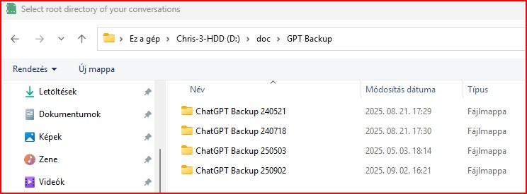
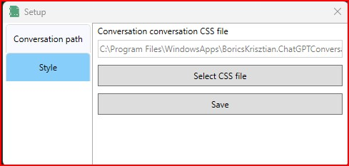
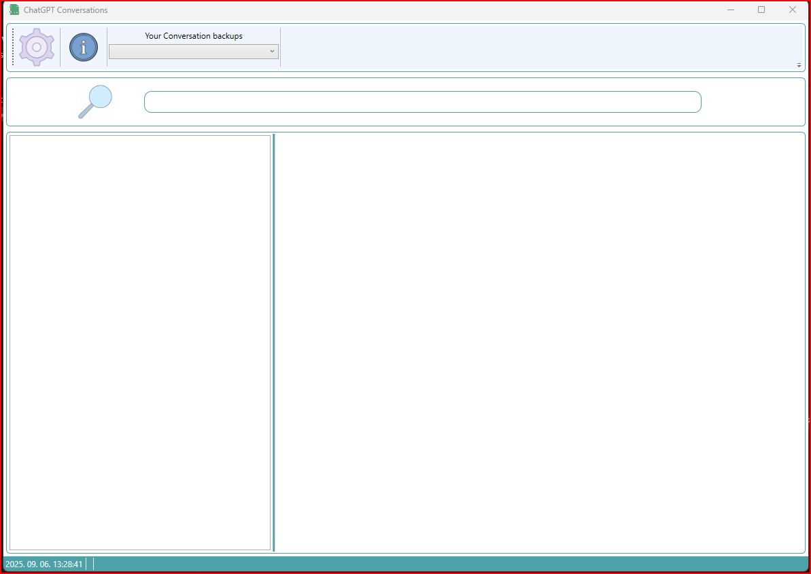
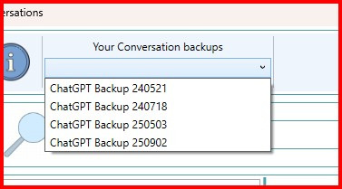
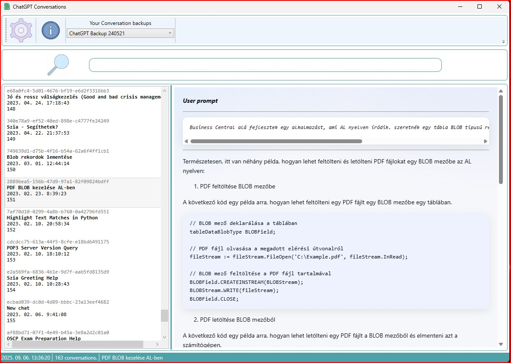
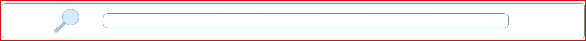
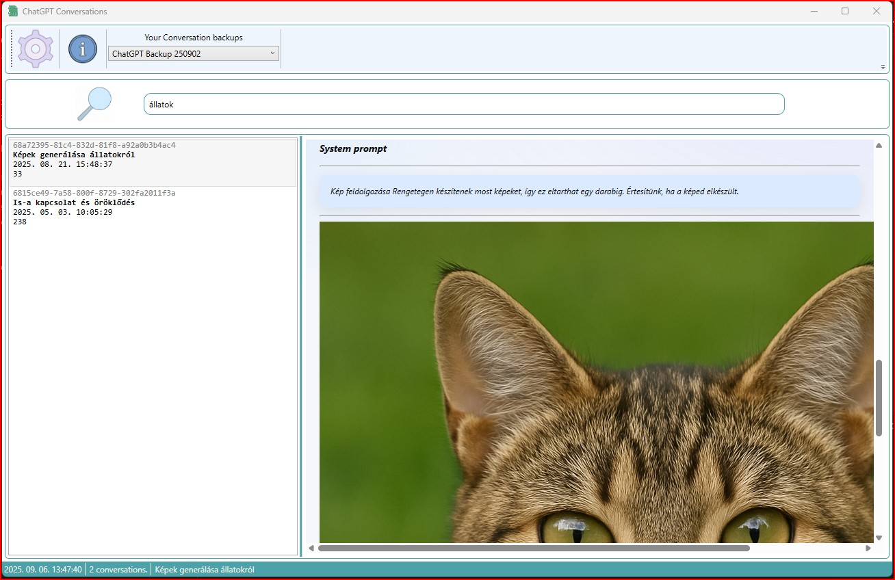
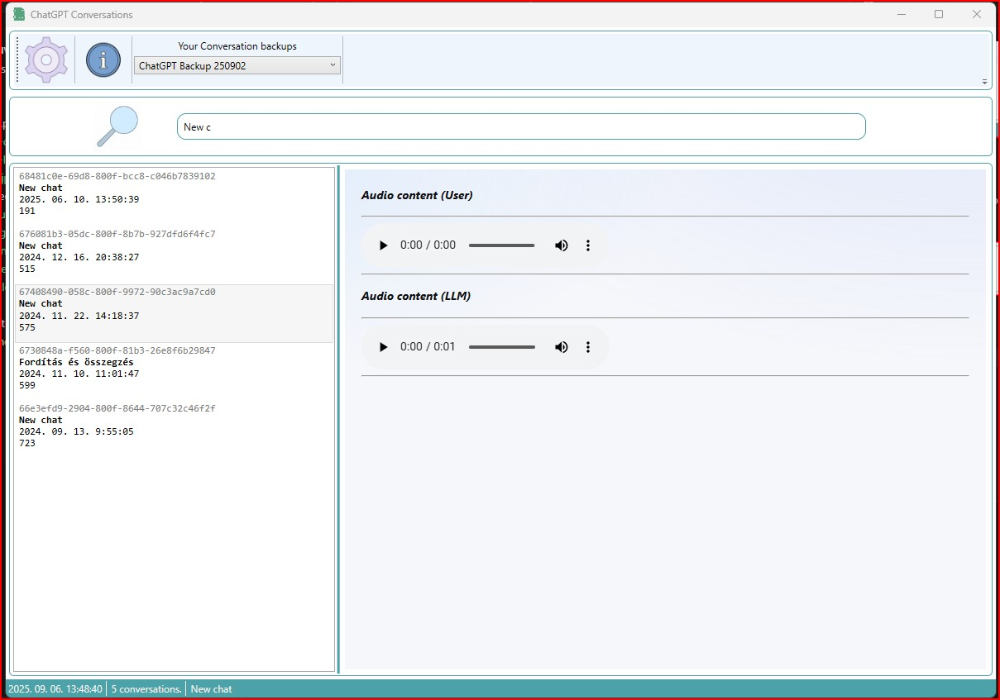

## ChatGPT Conversation Viewer
Browse your downloaded ChatGPT conversations with this app. You can download it from Miscosoft Store.
[Open app in MS Store](https://apps.microsoft.com/detail/9NVV9LN30LPQ)

### V1.0.2 Documentation
You will get some warnings on first launch because the setup is not complete.

#### Requirements

> Windows 10 / 11  
> .NET 8.0

#### Setup
After the app starts, click on the setup icon.

Then the following window will appear.

On the "Conversation path" tab, you need to define the directory that contains the downloaded conversations. To specify the directory, click the "select directory" button, then select the directory. In my case, it looks like this:

The "Conversations file name" is set by default, this file is in the downloaded and unzipped directory, it contains your conversations. This does not need to be changed unless OpenAI changes it. When all settings are ready, press the "Save" button and go to the "Style" tab. You should see this window:

You can customize the chat window using CSS. Here you need to set which CSS file the app uses to render the chat window. There is some style sheet defined for the app, but you can also edit the styles yourself. The style files are located in the app's "style" directory. I would like to draw your attention to the fact that apps downloaded from the store are not placed in the usual Program Files directory, but are placed here and you will find the styles within it.

\Program Files\WindowsApps\BoricsKrisztian.ChatGPTConversationViewer_1.0.2.0_x64__jq2m0m791tns8\GPTConversations\style

Select a style file and click "Save". The app will work properly after restarting.

#### Main screen

You can select the backup you want to see from the drop-down list:

The conversations are now visible in the list, you just need to click on the one you want to see.

#### Search

The search feature lets you search within the conversation's basic data and conversations. Just type something in the search field and the app will filter the database and only show you content that contains the phrase you entered. A counter in the status bar shows the number of hits.

#### Issue reporting

> <a href="https://github.com/boricsk/ChatGPT-Conversation-Viewer/issues" >Issues</a>

#### Support

If you like my work, please consider to support it with the price of a coffee on Patreon. Thank you! 
<a href="https://www.patreon.com/c/user?u=67730415" >Patreon</a>

#### Some other screensshoot

Generated picture

Audio content

